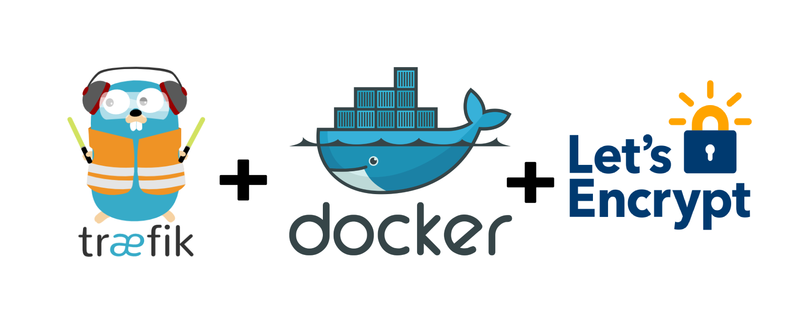

# docker-traefik

Examples of usage [Traefik] web-router as docker service with docker-compose.
To read full detail follow to [my blog post](https://gainanov.pro/eng-blog/devops/docker-web-service-with-traefik).

{: .align-center}

## What's inside

It consists next use cases:

1. Simple reverse-proxy ([docker-compose.yml](docker-compose.yml)):
  - an administration dashboard could be accessed by [http://localhost:8080](http://localhost:8080)

```
docker-compose up -f docker-compose.yml
```

2. Setup secured proxy with SSL using Let's Encrypt ([docker-compose-ssl.yml](docker-compose-ssl.yml)):
  - certificates will be saved into ./acme/acme.json
  - for test purposes uses Staging server. Comment line to use it in production.

```
docker-compose up -f docker-compose-ssl.yml
```

3. Setup a secured traefik dashboard with SSL and BasicAuth ([docker-compose-secure-dashboard.yml](docker-compose-secure-dashboard.yml))
  - to generate a password use a shell command: `echo $(htpasswd -nb admin password) | sed -e s/\\$/\\$\\$/g`
  - to get access them from browser define a domain in your DNS (or just add an IP into `/etc/hosts`)

```
docker-compose up -f docker-compose-secure-dashboard.yml
```

4. Setup a proxy redirected requests from selected domain to https scheme ([docker-compose-https-redirect.yml](docker-compose-https-redirect.yml))

```
docker-compose up -f docker-compose-https-redirect.yml
```

## Testing

After successful running services we can test them:
```
# curl -H Host:whoami.example.com http://localhost

Hostname: 3b64e9ee3e38
IP: 127.0.0.1
IP: 172.28.0.2
RemoteAddr: 172.28.0.3:55870
GET / HTTP/1.1
Host: whoami.example.com
User-Agent: curl/7.54.0
Accept: */*
Accept-Encoding: gzip
X-Forwarded-For: 172.28.0.1
X-Forwarded-Host: whoami.example.com
X-Forwarded-Port: 80
X-Forwarded-Proto: http
X-Forwarded-Server: a9dfe96d5877
X-Real-Ip: 172.28.0.1
```

## Next reading

I recommend to read an [official documentation][traefik] and [Docker Configuration Reference](https://docs.traefik.io/reference/dynamic-configuration/docker/).


[traefik]: https://docs.traefik.io/
